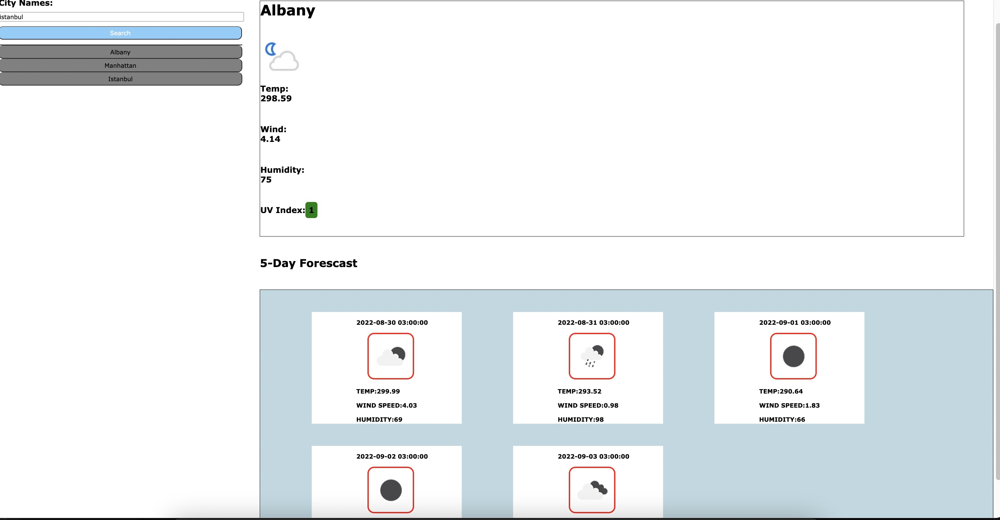

# Weather Dashboard

This is a weather dashboard with form inputs that will run in the browser and feature dynamically updated HTML and CSS. It allows the user to search to view weather outlook for multiple cities so travelers can plan a trip accordingly.

Weatherapi and OpenWeather API is used to retrieve weather data for cities. And localStorage is used to store persistent data.

## Functionality

**For this project, I need to build a website from scratch that will do the following tasks.** 

- When the user tries to search for a city, then current and future weather for the city will be displayed.
- For the current weather section, the following items should be displayed:
- the name of the city,

**an icon showing the current weather conditions** 
- the temperature,
- the humidity,
- the wind speed,
- the UV index with a color that indicates the servarity of the index.

**For the future forcast, there should be 5 days of weather displayed to the user with:** 
- the date,
- a weather icon for that day,
- the temperature,
- the humidity.

**When the user tries to search for a city, the city should be saved to the search history.**  
**The user should be able to select the saved city to view updated information for that city.**
**When the user opens the app, the city the user last looked at should be displayed to the screen.** 

# DEMO

## LINKS
- [GithubPage](https://github.com/mertcetnn?tab=repositories)
- [REPO](https://github.com/mertcetnn/Weather-Dashboard)
- [LiveLink](https://mertcetnn.github.io/Weather-Dashboard/)